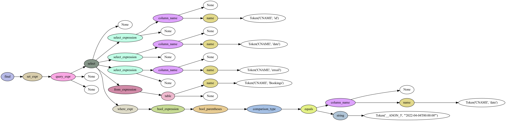

# PyFireSQL
PyFireSQL is a SQL-like programming interface to query [Cloud Firestore](https://firebase.google.com/products/firestore) collections using Python.

There is no formal query language to Cloud Firestore - NoSQL collection/document structure. For many instances, we need to use the cranky Firestore UI to navigate, scrolling and filtering through the endless records. With the UI, we have no way to extract the found documents. Even though we attempted to extract and update by writing a unique program for the specific task, we felt many scripts are almost the same that something must be done to limit the endless program writing. What if we can use SQL-like statements to perform the data extraction, which are both formal and reusable? - This idea will be the motivation of the FireSQL language!

## How to install
To install from PyPi,

```
pip install pyfiresql
```

To install from source,
```
cd PyFireSQL
python setup.py install
```

## Just Enough SQL for FireSQL
We don't need the full SQL parser and transformer. We can simply define ONLY the `SELECT` statement, just enough for Firestore collections query.

By using [Lark](https://lark-parser.readthedocs.io/en/latest/) EBNF-like grammar, we have encoded the core `SELECT` clause, which can translate into Firestore collection queries.
- SELECT columns for collection field's projection
- FROM sub-clause for collections
- FROM/JOIN sub-clause for joining collections (restricted to 1 join)
- WHERE sub-clause with boolean algebra expression for each collection's queries on field values
  - boolean operators: AND (currently OR is not implemented)
  - operators: =, !=, >, <, <=, >=
  - container expressions: IN, NOT IN
  - array contains expressions: CONTAIN, ANY CONTAIN
  - filter expressions: LIKE, NOT LIKE
  - null expressions: IS NULL
- All keywords are case insensitive. All whitespaces are ignored.

But the processor has the following limitations:
- No ORDER BY sub-clause
- No GROUP BY/HAVING sub-clause
- No WINDOW sub-clause

For example, the following statements can be expressed,

> docid is a special field name to extract the selected Document Id
```sql
  SELECT docid, email, state
    FROM
      Users
    WHERE
      state = 'ACTIVE'
```

> The '*' will select all fields, boolean operator 'AND' to specify multiple query criteria.
```sql
  SELECT *
    FROM
      Users
    WHERE
      state IN ('ACTIVE') AND
      u.email LIKE '%benny%'
```

> The field-subfield can use the `"` to escape the field name with `.` in it.
```sql
  SELECT *
    FROM
      Users as u
    WHERE
      u.state IN ('ACTIVE') AND
      u."location.displayName" = 'Work From Home'
```

> The `JOIN` expression to join 2 collections together
```sql
SELECT u.email, u.state, b.date, b.state
  FROM
    Users as u JOIN Bookings as b
    ON u.email = b.email
  WHERE 
      u.state = 'ACTIVE' AND
      u.email LIKE '%benny%' AND
      b.state IN ('CHECKED_IN', 'CHECKED_OUT') AND
      b.date >= '2022-03-18T04:00:00'
```

> See `firesql/sql/grammar/firesql.lark` for the FireSQL grammar specification.

### DateTime Type
We are using [ISO-8601](https://en.wikipedia.org/wiki/ISO_8601) to express the date-time as string. Firestore stores the date-time as `Timestamp` data type in UTC.
For example, if writting "March 18, 2022 at time 4 Hours in UTC" date-time string, it is "2022-03-18T04:00:00".

If in doubt, we are using the following to render and match the ISO-8601 date-time string.

```python
DATETIME_ISO_FORMAT = "%Y-%m-%dT%H:%M:%S"
DATETIME_ISO_FORMAT_REGEX = r'^(-?(?:[1-9][0-9]*)?[0-9]{4})-(1[0-2]|0[1-9])-(3[01]|0[1-9]|[12][0-9])T(2[0-3]|[01][0-9]):([0-5][0-9]):([0-5][0-9])(\.[0-9]+)?(Z|[+-](?:2[0-3]|[01][0-9]):[0-5][0-9])?$'
```

### Collection Path
The Firestore collection has a set of documents. Each document can be nested with more collections. Firestore identifies a collection by a path, looks like `Companies/bennycorp/Users` means `Companies` collection has a document `bennycorp`, which has `Users` collection.

If we want to query a nested collection, we can specify the collection name as a path. The paths can be long but we can use `AS` alias names.

For example, the subcollection `Users` and `Bookings` are specified.

```sql
SELECT u.email, u.state, b.date, b.state
  FROM
    Companies/bennycorp/Users AS u JOIN Companies/bennycorp/Bookings AS b
    ON u.email = b.email
  WHERE 
      u.state = 'ACTIVE' AND
      u.email LIKE '%benny%' AND
      b.state IN ('CHECKED_IN', 'CHECKED_OUT') AND
      b.date >= '2022-03-18T04:00:00'
```

## FireSQL to Firebase Query
We provided a simple firebase SQL interface class that can be easily applied a SQL statement to fetch from Firebase collections.

### Programming Interface
In PyFireSQL, we offer a simple programming interface to parse and execute firebase SQL.

```python
from firesql.firebase import FirebaseClient
from firesql.sql import FireSQL

# make connection to Cloud Firestore
client = FirebaseClient()
client.connect(credentials_json='credentials.json')

# query via the FireSQL interface - the results are in list of docs (Dict)
query = "SELECT * FROM Users WHERE state = 'ACTIVE'"
fireSQL = FireSQL()
docs = fireSQL.sql(client, query)
```

After `fireSQL.sql()` query completed, the results are a list of docs (as Dict) that satisfied the query.
Then we can pass the list of docs to render into any output format, in our case, the `DocPrinter` object can output `csv` or `json` with the select fields.

```python
from firesql.sql.doc_printer import DocPrinter

docPrinter = DocPrinter()
if format == 'csv':
  docPrinter.printCSV(docs, fireSQL.select_fields())
else:
  docPrinter.printJSON(docs, fireSQL.select_fields())
```

For further post-processing, we can use Pandas's Dataframe to perform any data analysis, grouping, sorting and calculations. The list of docs (as Dict) can be directly imported into Dataframe! very convenience.

```python
import pandas as pd

df = pd.DataFrame(docs)
```

### Query Script

In addition, we provide an interface script `firesql-query.py` to accept an FireSQL statement.

```
usage: firesql-query.py [-h] [-c CREDENTIALS] [-f FORMAT] [-i INPUT]
                        [-q QUERY]

optional arguments:
  -h, --help            show this help message and exit
  -c CREDENTIALS, --credentials CREDENTIALS
                        credentials JSON path
  -f FORMAT, --format FORMAT
                        output format (csv|json)
  -i INPUT, --input INPUT
                        FireSQL query input file (required)
  -q QUERY, --query QUERY
                        FireSQL query (required)
```
For example, finding all `ACTIVE` users from Users collection

```
python firesql-query.py -c credential.json \
  -q "SELECT docid, email, state FROM Users WHERE state IN ('ACTIVE')"
```
> `docid` is a special column name that is used to project the Firestore document ID.

The default query result is rendered in "csv" output format.

```
"docid","email","state"
"0r6YWowe9rW65yB1qTKsCe83cCm2","btscheung+real@gmail.com","ACTIVE"
"1utcUa9fdheOlrMe9GOCjrJ3wjh1","btscheung+bennycorp@gmail.com","ACTIVE"
"7CUJOqe6rlOTQuatc27EQGivZfn2","btscheung+twotwo@gmail.com","ACTIVE"
"7z1umMii01dGcSGYYJEHHrkx2Jp1","btscheung+o'mac*donald@gmail.com","ACTIVE"
"bdGp8UJmWPPFy9qGfmzZm76JPML2","btscheung+jet@gmail.com","ACTIVE"
"ccLmsxXcuJMrl04c3XS4e1tiV7X2","btscheung+threethree@gmail.com","ACTIVE"
"xQDDc7SXpqXxRAxIQWb1xPqdGYw2","btscheung+hill6@gmail.com","ACTIVE"
```

Alternatively, by specifying the `-f json` output format, the result will be,

```
[
{'docid': '0r6YWowe9rW65yB1qTKsCe83cCm2', 'email': 'btscheung+real@gmail.com', 'state': 'ACTIVE'},
{'docid': '1utcUa9fdheOlrMe9GOCjrJ3wjh1', 'email': 'btscheung+bennycorp@gmail.com', 'state': 'ACTIVE'},
{'docid': '7CUJOqe6rlOTQuatc27EQGivZfn2', 'email': 'btscheung+twotwo@gmail.com', 'state': 'ACTIVE'},
{'docid': '7z1umMii01dGcSGYYJEHHrkx2Jp1', 'email': "btscheung+o'mac*donald@gmail.com", 'state': 'ACTIVE'},
{'docid': 'bdGp8UJmWPPFy9qGfmzZm76JPML2', 'email': 'btscheung+jet@gmail.com', 'state': 'ACTIVE'},
{'docid': 'ccLmsxXcuJMrl04c3XS4e1tiV7X2', 'email': 'btscheung+threethree@gmail.com', 'state': 'ACTIVE'},
{'docid': 'xQDDc7SXpqXxRAxIQWb1xPqdGYw2', 'email': 'btscheung+hill6@gmail.com', 'state': 'ACTIVE'},
]
```
#### SQL Input File
For more complicated SQL, we can use `-i input.sql` to specify the SQL input file.

`input.sql` file:
```sql
SELECT u.email, u.state, b.date, b.state
  FROM
    Users as u JOIN Bookings as b
    ON u.email = b.email
  WHERE 
      u.state IN ('ACTIVE') and
      b.state IN ('CHECKED_IN', 'CHECKED_OUT') and
      b.date >= '2022-03-18T04:00:00'
```

By execute the input file

```
python firesql-query.py -c credentials.json -i input.sql
```

The result will be,
> NOTE: the column `state` from `Users` will be automatically disambiguated by appending the alias prefix `u_state`.

```
"email","u_state","date","state"
"btscheung+bennycorp@gmail.com","ACTIVE","2022-03-18T04:00:00","CHECKED_IN"
"btscheung+bennycorp@gmail.com","ACTIVE","2022-03-18T04:00:00","CHECKED_IN"
"btscheung+bennycorp@gmail.com","ACTIVE","2022-03-18T04:00:00","CHECKED_IN"
"btscheung+hill6@gmail.com","ACTIVE","2022-03-31T04:00:00","CHECKED_IN"
```

### Pattern Matching by LIKE
The SQL expression `LIKE` or `NOT LIKE` can be used for matching string data.

```sql
SELECT docid, email, state
  FROM
    Users
  WHERE
    state IN ('ACTIVE') AND
    email LIKE '%benny%'
```

After the Firebase query, the pattern matching is used as the filtering expression. The SQL processor supports pattern for:
- prefix match `pattern%`
- suffix match `%pattern`
- infix match `%pattern%`


## FireSQL Parser Explained
The FireSQL parser, consists of two parts: the lexical scanner and the grammar rule module. Python parser generator [Lark](https://lark-parser.readthedocs.io/en/latest/) is used to provide the lexical scanner and grammar rule to parse the FireSQL statement. In the end, the parser execution generates the parse tree, aka. AST (Abstract Syntax Tree). The complexity of the FireSQL syntax requires an equally complex structure that efficiently stores the information needed for executing every possible FireSQL statement.

For example, the AST parse tree for the FireSQL statement
```
SELECT id, date, email
  FROM Bookings
  WHERE date = '2022-04-04T00:00:00'
```



This is delightful to use `lark` due to its design philosophy, which clearly separate the grammar specification from processing. The processing is applied to the parse tree by the Visitor or Transformer components.

### Visitor and Transformer
Transformers & Visitors provide a convenient interface to process the parse-trees that Lark returns. Lark document defines,

* **Visitors** - visit each node of the tree, and run the appropriate method on it according to the node’s data. They work bottom-up, starting with the leaves and ending at the root of the tree.
* **Transformers** -  work bottom-up (or depth-first), starting with visiting the leaves and working their way up until ending at the root of the tree.
  * For each node visited, the transformer will call the appropriate method (callbacks), according to the node’s `data`, and use the returned value to replace the node, thereby creating a new tree structure.
  * Transformers can be used to implement map & reduce patterns. Because nodes are reduced from leaf to root, at any point the callbacks may assume the children have already been transformed.

> Using Visitor is simple at first, but you need to know exactly what you're fetching, the children chain can be difficult to navigate depending on the grammar which produce the parsed tree.

We decided to use Transformer to transform the parse tree to the corresponding SQL component objects that can be easily consumed by the subsequent processing.

For instance, the former example parse tree is transformed into SQL components as,

```
SQL_Select(
  columns=[SQL_ColumnRef(table=None, column='id'),
           SQL_ColumnRef(table=None, column='date'),
           SQL_ColumnRef(table=None, column='email')],
  froms=[SQL_SelectFrom(part='Bookings', alias=None)],
  where=SQL_BinaryExpression(operator='==',
                             left=SQL_ColumnRef(table=None, column='date'),
                             right=SQL_ValueString(value='2022-04-04T00:00:00'))
)
```


## References
- Gabriele Tomassetti, [Parsing In Python: Tools And Libraries](https://tomassetti.me/parsing-in-python/)
- [Lark Documentation](https://lark-parser.readthedocs.io/en/latest/)
  - Repo: [lark-parser](https://github.com/lark-parser/lark)
- SQL Parsing [sql_to_ibis](https://github.com/zbrookle/sql_to_ibis)

